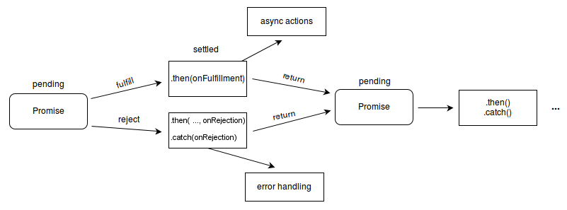

# Promises

* `Promise` is a constructor that makes promise objects (promises).
* Promises represent the eventual completion or failure of an asynchronous operation, and its resulting value.
* Instead of taking callbacks for success/failure as arguments, modern async functions will return a promise object.
  - You can then call promise.then(successCallback, failureCallback)

## Benefits

* Can add more callbacks with promise.then() later, even after the success/failure of an operation.
* Can call .then() several times, and they will be executed in order.
* Can make a *promise chain*:
  - then .then() function returns a new promise, which represents the completion of the original task and the success or failure callback.
  - So you can call .then() on that promise, and add a callback to be queued behind that
  - can therefore make a chain of asynchronous steps without a callback 'pyramid of doom' like below:

```
doSomething(function(result) {
  doSomethingElse(result, function(newResult) {
    doThirdThing(newResult, function(finalResult) {
      console.log('Got the final result: ' + finalResult);
    }, failureCallback);
  }, failureCallback);
}, failureCallback);
```
  - instead:

```
doSomething().then(function(result) {
  return doSomethingElse(result);
})
.then(function(newResult) {
  return doThirdThing(newResult);
})
.then(function(finalResult) {
  console.log('Got the final result: ' + finalResult);
})
.catch(failureCallback);
```
  - where e.g. newResult refers to the return value of doSomethingElse, and doThirdThing only happens when doSomethingElse is done.
  - `catch(failureCallback)` is short for `then(null, failureCallback)`: it basically has a failurecallback but not a successone: this is useful at the end, because it means you either get a successful chain of successes, or one big failure at the end. Use it!
    - (will catch an error further up the chain because they propagate down looking for catches)
    - can still chain after catch if you want



## Syntax for creating a promise
* Call `new Promise` with an **executor function** as an argument.
* The executor function takes the parameters resolve and reject.
* The executor function body typically does some asynchronous stuff, and then calls resolve if it succeeds it or reject if an error occurs.
